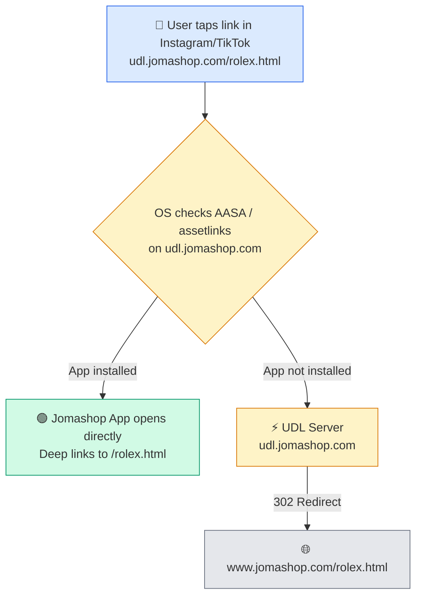

# Jomashop UDL Server

A simplified, production-ready fork of [fdocr/udl-server](https://github.com/fdocr/udl-server) — stripped down to a single-purpose path-passthrough redirect server for Jomashop mobile app deep linking.

## How it works

Bounces traffic through a separate domain so iOS Universal Links and Android App Links trigger correctly — even when users are browsing inside webviews (Instagram, TikTok, etc).



## Usage

All paths are forwarded to `DEFAULT_DESTINATION`:

- `https://udl.jomashop.com/` → redirects to `DEFAULT_DESTINATION`
- `https://udl.jomashop.com/watches/rolex` → redirects to `DEFAULT_DESTINATION/watches/rolex`

## Smart App Store Link

`/download` detects the visitor's OS via user-agent and instantly redirects:

| Device  | Destination |
|---------|-------------|
| iPhone / iPad | [App Store](https://apps.apple.com/us/app/jomashop-designer-shopping/id6444218472) |
| Android | [Google Play](https://play.google.com/store/apps/details?id=com.jomashop.app) |
| Desktop / Other | [jomashop.com/app/](https://www.jomashop.com/app/) |

The redirect fires in `<script>` before the page renders, so it's effectively instant. If JS is disabled or the redirect stalls, users see a polished fallback page with manual store buttons.

**Use it as a single link** in email campaigns, QR codes, social bios, etc:
```
https://udl.jomashop.com/download
```

## Environment Variables

| Variable | Description | Example |
|---|---|---|
| `DEFAULT_DESTINATION` | Target site for all redirects | `https://www.jomashop.com` |
| `PORT` | Server port (default `3000`) | `3000` |

## Performance

Crystal + Kemal — microsecond response times.


